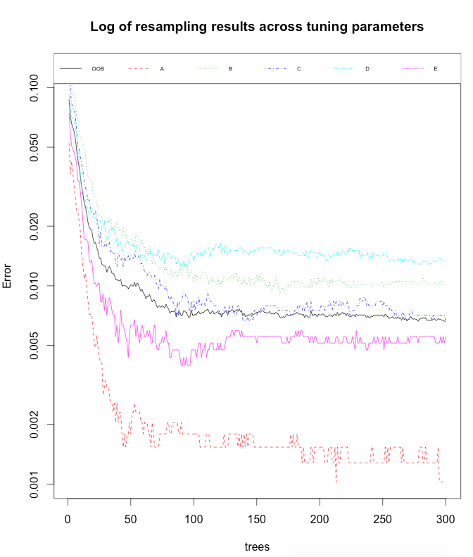
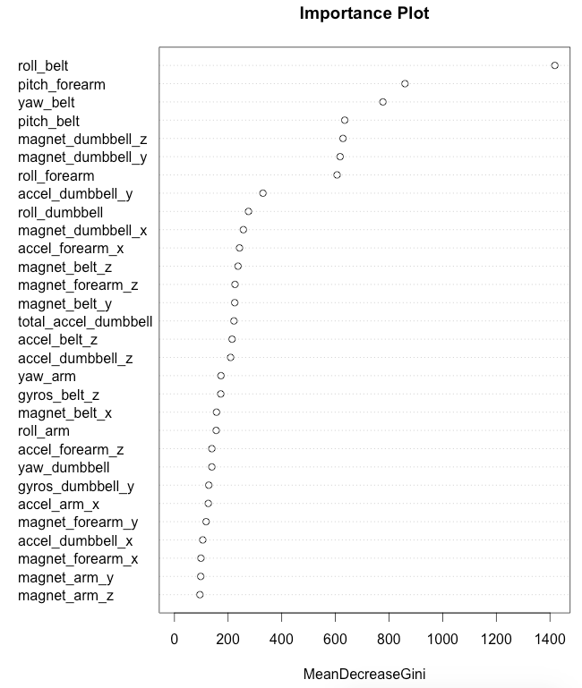
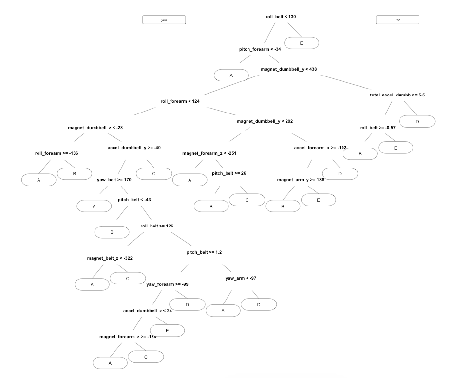

# Quantified Self Movement Data Analysis
### Assignment Writeup - Practical Machine Learning Course

__By Marcus Williamson__

## Introduction

Using devices such as Jawbone Up, Nike FuelBand, and Fitbit it is now possible to collect a large amount of data about personal activity relatively inexpensively. These type of devices are part of the quantified self movement – a group of enthusiasts who take measurements about themselves regularly to improve their health, to find patterns in their behavior, or because they are tech geeks. One thing that people regularly do is quantify how much of a particular activity they do, but they rarely quantify how well they do it. In this project, your goal will be to use data from accelerometers on the belt, forearm, arm, and dumbell of 6 participants. They were asked to perform barbell lifts correctly and incorrectly in 5 different ways. More information is available from the website here: http://groupware.les.inf.puc-rio.br/har (see the section on the Weight Lifting Exercise Dataset). 

---

### Importing and Cleaning Data

We begin by importing our libraries that we may need to use during the analysis and model creation
```r
library(caret)
library(randomForest)
library(ElemStatLearn)
library(rpart)
library(doMC)
library(tree)
library(rpart.plot)
```
We also set our seed for **reproduciblity of results** and number of cores available for processing with 
```r
set.seed(8484) 
registerDoMC(cores = 8) # for parallel processing
```

Next we import our data from the source links into our R environment, as training and testing data. Although in this case the data has been imported directly into R environment I have saved CSV copies in the Data folder within the repository that can be easily imported into R
```r
rawtraindata = read.csv(url("https://d396qusza40orc.cloudfront.net/predmachlearn/pml-training.csv"))
rawtestdata = read.csv(url("https://d396qusza40orc.cloudfront.net/predmachlearn/pml-testing.csv"))
```

Taking an initial look at our data:
```r
dim(rawtraindata);dim(rawtestdata)
```
```
[1] 19622   160
[1] 20      160
```
Under further visual inspection, it reveals variables in the raw data import that are not useful in prediction and are difficult to work with in a Machine Learning problem, we proceed to clean the datasets
```r
classe <- rawtraindata$classe # keeping our classe variables aside that we will need to fit a model for

names <- grepl("X|timestamp|window|name", colnames(rawtraindata)) # getting all non predictive variables column names
 
rawtraindata = rawtraindata[,!names] # removing columns
rawtestdata = rawtestdata[,!names] # repeating for test dataset

rawtraindata = rawtraindata[ ,colSums(is.na(rawtraindata))==0] # if data is "NA" remove columnn
rawtestdata = rawtestdata[ ,colSums(is.na(rawtestdata))==0] # repeat for test dataset
 
traindata = rawtraindata[ ,sapply(rawtraindata,is.numeric)] # if data is non existent or non numeric remove column
testdata = rawtestdata[ ,sapply(rawtestdata,is.numeric)] # repeat for test dataset
 
traindata$classe = classe # adding our classe column back into the training dataset
```

---

### Data Partitioning 

We split our training data into training and validation as we seek to implement [Cross Validation](https://en.wikipedia.org/wiki/Cross-validation_(statistics)) in this model. We choose a 70:30 split for are training and validation set as we have a suitable amount of data, in order to reduce the variance in the parameter estimates. This is also roughly in line with the split of 60% Training 20% Validation (scaling up to give up 75:25 split).
```r
inTrain <- createDataPartition(y=traindata$classe,p=0.70, list=FALSE) # using a 70:30 split
 
training <- traindata[inTrain,] # 70% of data for training
testing <- traindata[-inTrain,] # 30% of data for validation
 
dim(training);dim(testing) # ensuring we have sufficient volumes for this 70:30 split
```
```
[1] 13737    53
[1] 5885   53
````

---

### Creating the Model

We decide to build and train a Random Forest model with K-Fold Cross Validation.

* This allows us to use trees in the model with a reduction in bias and variance by utilitsing many trees in the prediction. 
* This is also a relatively effective solution to Machine Learning problems when the underlying distribution of the data is unknown. 
* K-Fold (10) cross validation is used as an old and reliable technique vs some more advanced Nested Monte Carlo based concepts 
* Larger K means less bias towards overestimating the true expected error, with training folds being less close to the total dataset, but higher variance and more computationally expensive, larger K also give you more samples to estimate on
```r
modFit <- train(classe ~ ., data=training,method="rf", trControl=trainControl(method="cv", number=10), verbose=FALSE, ntree=300, allowParallel=TRUE)
```

We then examine the model that has been created.
```r
modFit 
```
```
Random Forest 

13737 samples
   52 predictor
    5 classes: 'A', 'B', 'C', 'D', 'E' 

No pre-processing
Resampling: Cross-Validated (10 fold) 
Summary of sample sizes: 12363, 12364, 12364, 12362, 12364, 12365, ... 
Resampling results across tuning parameters:

  mtry  Accuracy   Kappa      Accuracy SD  Kappa SD   
   2    0.9916282  0.9894090  0.003636014  0.004600016
  27    0.9925018  0.9905145  0.002329291  0.002947354
  52    0.9856587  0.9818570  0.004643253  0.005873526

Accuracy was used to select the optimal model using  the largest value.
The final value used for the model was mtry = 27. 
````

---

### Model Accuracy and Out of Sample Error

We first look at the error matrix and summary statistics of the model
```r
prediction <- predict(modFit, testing)
confusionMatrix(testing$classe, prediction) # printing error matrix
```
```
Confusion Matrix and Statistics

          Reference
Prediction    A    B    C    D    E
         A 1673    1    0    0    0
         B    9 1124    5    1    0
         C    0    4 1019    3    0
         D    0    0    8  956    0
         E    0    1    2    6 1073

Overall Statistics
                                          
               Accuracy : 0.9932          
                 95% CI : (0.9908, 0.9951)
    No Information Rate : 0.2858          
    P-Value [Acc > NIR] : < 2.2e-16       
                                          
                  Kappa : 0.9914          
 Mcnemar's Test P-Value : NA              

Statistics by Class:

                     Class: A Class: B Class: C Class: D Class: E
Sensitivity            0.9946   0.9947   0.9855   0.9896   1.0000
Specificity            0.9998   0.9968   0.9986   0.9984   0.9981
Pos Pred Value         0.9994   0.9868   0.9932   0.9917   0.9917
Neg Pred Value         0.9979   0.9987   0.9969   0.9980   1.0000
Prevalence             0.2858   0.1920   0.1757   0.1641   0.1823
Detection Rate         0.2843   0.1910   0.1732   0.1624   0.1823
Detection Prevalence   0.2845   0.1935   0.1743   0.1638   0.1839
Balanced Accuracy      0.9972   0.9958   0.9920   0.9940   0.9991
````
It appears the final model was relatively successful in predicting the Classes of the data, with few classes incorrect.


We next look at the model's accuracy and out of sample error.
```r
accuracy <- postResample(prediction, testing$classe) # calculating accuracy
ose <- 1 - as.numeric(confusionMatrix(testing$classe, prediction)$overall[1]) # calculating out of sample error
``` 
```r
accuracy
```
```
Accuracy     Kappa 
0.9932031 0.9914017 
```

```r
ose 
```
```
[1] 0.006796941
````
The **estimated accuracy** of the model is **99.32%** and the **estimated out of sample error** is **0.68%**.

---

### The Prediction Results

We now run the test dataset through the model we have built and trained, to predict the unseen data's classes:
```r
results <- predict(modFit, testdata[, -length(names(testdata))])
results
```
```
[1] B A B A A E D B A A B C B A E E A B B B
Levels: A B C D E
```

---

### Figures

Visualising the error rate in the final model for the different Classes and [OOB](http://stackoverflow.com/questions/18541923/what-is-out-of-bag-error-in-random-forests) (Out of bag error).
```r
plot(modFit$finalModel,main="Log of resampling results across tuning parameters", log="y")
finalmodel.legend <- if (is.null(modFit$finalModel$test$err.rate)) {colnames(modFit$finalModel$err.rate)} 
                     else {colnames(modFit$finalModel$test$err.rate)}
legend("top", cex =0.5, legend=finalmodel.legend, lty=c(1,2,3,4,5,6), col=c(1,2,3,4,5,6), horiz=T) 
```


Plotting the importance of the different variables, showing how important the Roll Belt variable is compared to the Roll Arm variable.
```r
varImpPlot(modFit$finalModel, main="Importance Plot")
```


Plotting an example tree. As Random Forest is black box algorithm so to speak, a single tree **does not represent the model** but is useful for sense checking data and how an example trees are likely to be splitting.
```r
treeout <- rpart(classe ~ ., data=training) # creating a single tree from the training data
prp(treeout,uniform=T, xsep="/") 
```

